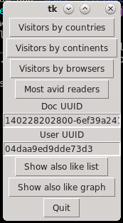

 
 
 
 
 

# Industrial Programming <!-- omit in toc -->
## F21SC Final coursework <!-- omit in toc -->
### Louis Prud’homme <!-- omit in toc -->
### H00360678 <!-- omit in toc -->

# Table of contents

- [Table of contents](#table-of-contents)
- [Introduction](#introduction)
- [Requirements’ checklist](#requirements-checklist)
- [Design consideration](#design-consideration)
- [User guide](#user-guide)
- [Developer guide](#developer-guide)
- [Testing](#testing)
- [Reflections on programming language and implementation](#reflections-on-programming-language-and-implementation)
- [What did I learn from CW1 ?](#what-did-i-learn-from-cw1-)
- [Conlusions](#conlusions)
- [References](#references)

# Introduction

This report is written to support, comment, motivate and explain the project realized for the second coursework of the Industrial Programming course.

The objective of the coursework was to provide an experience with a scripting language, Python, in a Unix environment ; to this end, I was asked to develop a script to analyze the data of a document tracker.

As I am much less familiar with Python and generally speaking scripting languages than I am with compiled ones such as Java or C#, I sought to expriment and tinker as much as I could with my code to test both the strenghts and weaknesses of Python.

As I was neither very comfortable with the class system in Python nor the libraries we had to use, I decided to give up some of the app’s scalability in favor of development easeness.

To actively fight against «spaghetti code», I extensively divided my code into smaller functions, with some notable exceptions.

# Requirements’ checklist

- [x] Python
- [x] Views by country continent
  - [x] Histogram of countries
  - [x] Histogram of continents
- [x] Views by browser
  - [x] Histogram of user agent
  - [x] Histogram of browser 
- [x] Histogram top ten avid readers
- [x] «Also likes»
  - [x] List of all visitors UUID readers of a document
  - [x] List of all documents UUID read by a visitor
  - [x] List of «liked» documents
  - [x] Previous function sorted with a parameter function
  - [x] List of «also liked» documents
- [x] «Also liked» graph
- [x] GUI usage
- [x] Command-line usage
- [x] Testing

# Design consideration

As said in the introduction, I opted for a very horizontally distributed, loose architecture, structured by functions only. This is acceptable in my opnion as this is a script which does not bear a lot complexity ; as such, I felt I could use this simple code organization.

It allows for faster development at the cost of poor maintenability and scalability ; fortunately, these were not core objectives of this script. It allowed me to better and further experiment with Python, Pandas, TKinter and Pyplot, espcially since my personal machine runs Windows, as it pushed me to also experiment with the Windows Subsystem for Linux.

In spite of the horizontal and loosely structured code organization, I tried to maintain a rigorous code division, notably through functions but also but grouping code parts together when they had the same kind of purpose.

In addition, I also choose to map the continents through a JSON datafile which is fetched on internet by the script. The JSON file can be seen at [http://country.io/continent.json](http://country.io/continent.json).

# User guide

The application is made to function through the command-line. Most of the positional arguments are required, with the notable exception of `-u` for the user UUID.

As specified in the requirements, each task can and must be launched through the postional `-t <task_id>` parameter. 

For tasks *2a* to *6*, the script will prompt one graphical piece of information ; most of the time, an histogram representing the wanted data, as well as information popups or images.

Beyond, for the task *7*, a graphical interface appears.

<i>Graphical interface of the app</i>

The GUI is simple and the controls pretty straightforward. Each of the four topmost buttons display a different chart. The histogram for user agents is not provided, as it was unreadable.

Two text inputs and their labels are positioned immediately afterwards ; they are meant to allow the user to change both the user and the document UUIDs specified through the command line and provide a clear display of the current values.

Finally, the two last controls before the quit button will display the list and the graph of «also like» documents.

# Developer guide

The code is splitted into several categories to provide an organisation as clean as possible.

The first section of the code contains all the program’s variables, the initialization functions, user-submitted parameters parsing and the branching to the other parts of the application. This section could be akin to the controller in the classical Model-View-Controller architecture.

The second section is dedicated to data manipulation ; this is akin to the model in MVC, as this section stricly provides data.

The two remaining sections are reminescent of the view module in the MVC pattern ; one handles the plotting and representation of data, while the other is almost entirely dedicated to the user interface.

The most complex parts of the application are located around the «also like» functionnality. In fact, the most complex functions, `get_like` and `show_also_like_graph` were written for this purpose.

Finally, even though the `show_gui` function is quite long, it was not splitted as it is also largely straightforward and flat.

# Testing

# Reflections on programming language and implementation

# What did I learn from CW1 ?

# Conlusions

# References

